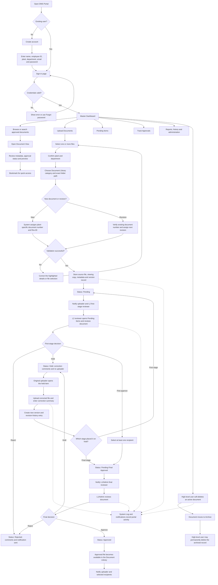
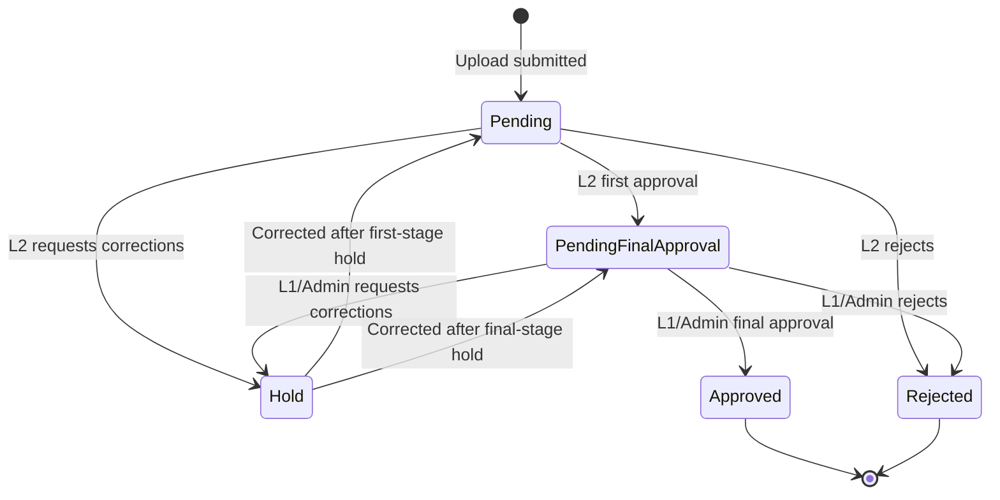

# DMS Portal — Updated Process Flow and Page Navigation

## Purpose

This guide describes the current ZF Rane Document Management System (DMS) as implemented in the portal. The supplied process-flow images were used as layout and coverage references; the steps below follow the current application pages and workflow.

## 1. Current end-to-end process flow

## 2. Approval status flow

The portal displays **Pending Final Approval** after a successful first-stage decision. “First Approved” is the reviewer action that causes this transition; it is not the final published status.

## 3. Roles and access used by the current portal

| User/access type | Main capability |
|---|---|
| Standard user | Register, sign in, upload, browse the dashboard and library, view documents, track own submissions, use bookmarks, and manage profile. |
| Original uploader | All standard-user actions plus correction and resubmission when their document is on Hold. |
| QMS L2 reviewer | First-stage decision for documents in Pending status. Can first-approve, hold, or reject. |
| QMS L1 reviewer or Admin | Final decision for documents in Pending Final Approval status. Can approve, hold, or reject. |
| Admin, Manager, Supervisor, or Approver role | Can access the high-level Archive, System Log, and People pages. |
| Admin | Full QMS L1 access, cross-scope upload, document version update, and Portal Updates administration. |

Role and QMS level are separate controls. Approval authority is determined by QMS level: L2 for first review and L1/Admin for final review.

## 4. Step-by-step page navigation

### A. Sign in, register, or reset a password

1. Open the DMS Portal.
2. On **Sign in**, enter a registered **GEN ID or email** and **Password**.
3. Select **Sign in**.
4. If the credentials are valid, the portal opens the **Master Dashboard**.
5. If the credentials are invalid, correct them and try again.
6. For a new account, select **Create an account**.
7. Enter full name, employee ID, plant, department, email, password, and password confirmation.
8. Select **Create account**, then return to **Sign in**. New accounts receive standard uploader access; higher access is assigned separately.
9. If the password is forgotten, select **Forgot password?**, enter the registered email, and use the reset link sent by the system.

### B. Use the Master Dashboard

1. After sign-in, the portal opens **Dashboard**.
2. Use **Document Library statistics** to open one of the current library categories:
   - Quality Management System
   - Customer Specific Requirements
   - Core Tools Manuals
   - Customer Score Card
   - Environment, Occupational Health and Safety Management System
   - Awards and Certifications
3. Use **What would you like to do?** for shortcuts to Upload Documents, Pending Items, Document Library, Track Approvals, Reports and Trends, and Revision History.
4. High-level users also see Archive, System Log, and People and Access shortcuts.
5. Use **Bookmarks** to reopen saved documents.
6. Use **Recently viewed** to reopen the last five viewed documents.
7. In the **Documents** section, search by file, uploader, document number, revision, category, customer, department, or date.
8. Apply the plant, department, customer, and status filters as required.
9. Select **Apply** to run the search or **Reset** to clear it.
10. Select **Export current view** to download the filtered table as CSV.
11. Use the eye/view action to open the document, the bookmark action to save it, or—where permitted—the edit/delete actions.

### C. Upload a new document

Navigation: **Sidebar → Upload Documents** or **Dashboard → Upload documents**.

1. In Step 1, drag files into the upload area or select **browse files**.
2. Select one or more supported files: PDF, DOC/DOCX, XLS/XLSX, or PPT/PPTX. The portal limit is 100 MB per request.
3. In Step 2, review the uploader name and employee details shown by the portal.
4. Confirm the **Plant** and **Department**. Standard users are restricted to their assigned scope; Admin, L1, and L2 users can select another allowed scope.
5. For a new document, the **Document Number** is assigned automatically for the selected plant and the revision starts at **Rev.00**.
6. Select the **Category**.
7. Select every required Folder/Subfolder/List field until the complete **Document Library path** is displayed.
8. If the upload is a revision, select **This upload is a revised document**, verify the existing document number, and enter a change summary. The portal calculates the next revision number.
9. Review the file list, scope, and library path.
10. Select **Submit for Approval**.
11. When validation succeeds, the file, metadata, viewing copy, and version record are stored; the status becomes **Pending**.
12. The uploader receives confirmation and the L2 reviewer receives a first-approval request.
13. The portal redirects to the selected Document Library category.

If submission is blocked, check that a file is selected, plant and department are available, a category is selected, the complete library path is chosen, and any revision document number is valid for the selected plant.

### D. Review and decide a pending item

Navigation: **Sidebar → Pending Items** or **Dashboard → Pending items**.

1. Use search and the status filter to find the record.
2. Select **Review**.
3. On the review page, verify the document number, revision, category, uploader, upload date, plant, department, and current status.
4. Inspect the embedded preview or open the document in a separate browser tab when that action is shown.
5. For the first stage, the designated L2 reviewer chooses one action:
   - **First Approve**: select at least one valid recipient from the People directory, then send the item to final approval.
   - **Hold**: enter the corrections required. The original uploader is notified.
   - **Reject**: enter mandatory rejection comments. The uploader is notified and the workflow ends.
6. After first approval, the status becomes **Pending Final Approval** and the L1/Admin final reviewer is notified.
7. For the final stage, the designated L1/Admin reviewer chooses:
   - **Approve**: the status becomes Approved; the uploader and selected recipients are notified.
   - **Hold**: enter corrections required and return it to the uploader.
   - **Reject**: enter rejection comments and end the workflow.

Bulk decisions are intentionally disabled because every item requires staged review, recipient selection, and an individual decision trail.

### E. Correct and resubmit a held document

1. The original uploader opens the Hold notification or finds the record in **Track Approvals** or **Pending Items**.
2. Open the review page and read the requested corrections.
3. Select the corrected file.
4. Enter a **Correction summary**.
5. Select **Upload correction and continue approval**.
6. The portal creates a new stored version and revision-history entry.
7. A first-stage hold returns to **Pending**; a final-stage hold returns to **Pending Final Approval**.
8. The relevant reviewer is notified and the approval workflow continues from that stage.

### F. Track approval progress

Navigation: **Sidebar → Track Approvals** or **Dashboard → Track approvals**.

1. The default **Mine** scope shows submissions belonging to the signed-in user.
2. High-level users may switch to the all-records scope.
3. Search by document details and filter by status.
4. Review the tracker summary and stage indicators for Pending, Pending Final Approval, Hold, Approved, or Rejected.
5. Open the related item when review, correction, or further detail is required.

### G. Browse the Document Library

Navigation: **Sidebar → Document Library**, **Dashboard → Open library**, or select a category statistic.

1. The overview displays the six current library folders.
2. Select a category.
3. Follow the category-specific folders, subfolders, plant, department, customer, audit, or list choices shown on screen.
4. Only approved uploaded documents are merged into the controlled library folders.
5. Select a file to open it in **Document View**.
6. Use **All folders** or the breadcrumb to return to the library overview.

### H. View a document

1. Open a document from Dashboard, Bookmarks, Recently viewed, Pending Items, or Document Library.
2. Review the status, document number, revision number, category, requester, and upload date.
3. Review the inline preview. PDF, supported Office formats, images, text, and spreadsheet previews are handled according to the generated viewing copy available to the portal.
4. Select the bookmark icon to add or remove the document from Dashboard shortcuts.
5. Use **Previous** to return to the originating page or the Home icon to return to Dashboard.

### I. Use reports and history

**Graphics Report**

1. Open **Sidebar → Graphics Report**.
2. Review totals for all, approved, pending, rejected, and held documents.
3. Select a summary to open the matching Dashboard document view.
4. Move through the graph carousel for overall, plant-wise, customer-linked, department-wise, upload-trend, and library-category views.

**Revision History**

1. Open **Sidebar → Revision History**.
2. Filter by plant and department.
3. Select **Apply** or **Reset**.
4. Review the file, revision number, previous file, change summary, user, plant, department, date, and time recorded for each revision.

### J. Use Archive, System Log, People, and Portal Updates

These pages are visible only when the signed-in user has the required higher-level access.

**Archive**

1. A permitted user deletes an active document from the Dashboard.
2. The record is removed from the active document table and moved to **Archive**.
3. Open **Sidebar → Archive** to review archived records.
4. Select **Delete** only when permanent deletion is intended. The current Archive page does not provide a Restore action.

**System Log**

1. Open **Sidebar → System Log**.
2. Filter by the action type.
3. Review logged uploads, views, decisions, resubmissions, deletions, emails, and other auditable actions.

**People**

1. Open **Sidebar → People**.
2. Review the user directory, role, plant, department, and QMS access level.
3. Authorized administrators can edit a user's QMS level.

**Portal Updates — Admin only**

1. Open **Sidebar → Portal Updates** or **Notifications → Create update**.
2. Create a portal update for users.
3. Users receive the update through the notification panel and popup behavior.

### K. Notifications, profile, appearance, and sign out

1. Select the bell icon in the top bar to open **Notifications**.
2. Select a linked notification to open its related document or review page.
3. Use **Mark all read** or **Clear all** when required.
4. Open **Sidebar → Profile** or select the user chip.
5. On Profile, upload an avatar, edit profile information, change the password, and review personal activity logs.
6. Use the sun/moon button to switch between light and dark appearance.
7. Select **Sign out** in the top bar.
8. The session ends and the portal returns to the sign-in page.

## 5. Important differences from the reference diagrams

- The current workflow has two approval stages: L2 first approval followed by L1/Admin final approval.
- The correction loop is named **Hold**, and only the original uploader can upload the corrected file and resubmit it.
- First approval requires selecting at least one recipient from the People directory.
- New document numbers are assigned automatically per plant; new uploads start at Rev.00.
- The upload page currently accepts PDF and Microsoft Office document formats; JPG and PNG are not offered as upload choices on that page.
- The Document Library currently has six top-level categories listed in this guide.
- The current Archive page supports review and permanent deletion but does not provide Restore.
- Bulk approval is disabled to preserve the staged individual review trail.
- Notifications, bookmarks, recently viewed documents, portal updates, and the dedicated Track Approvals page are part of the current navigation.

